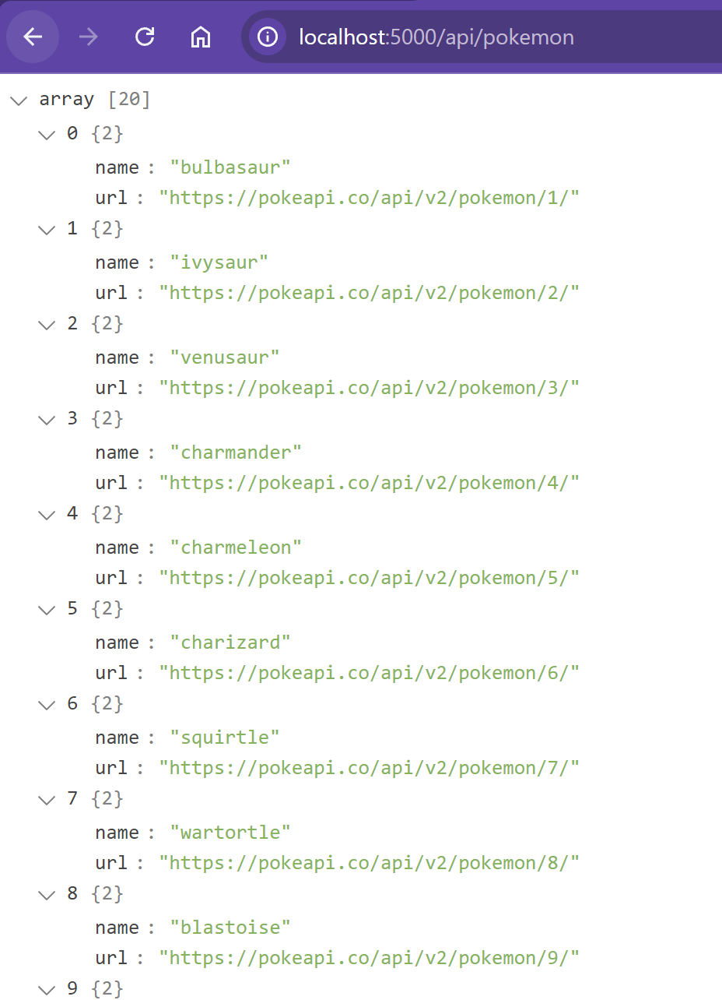
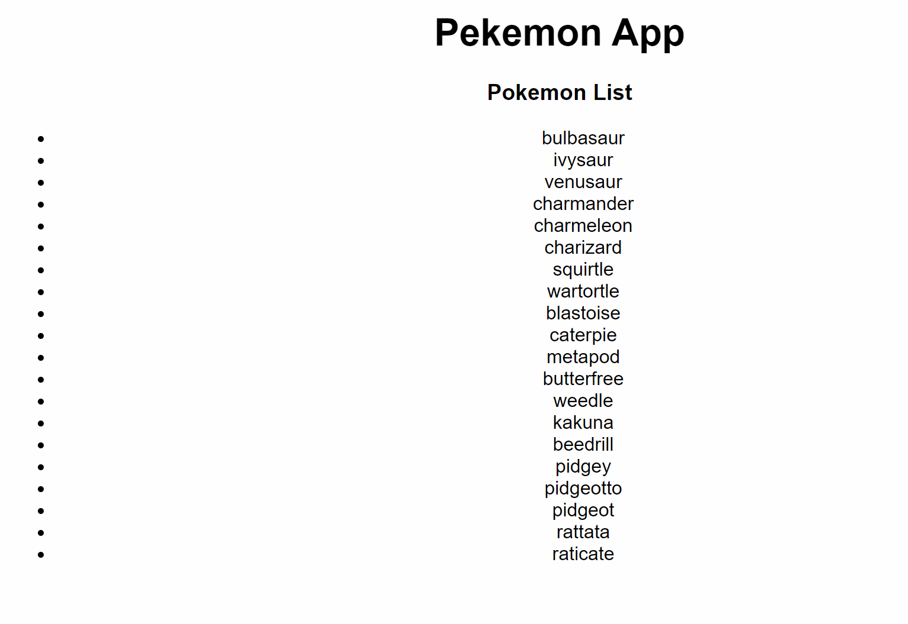

## **🛠 Frontend Setup **

### **Folder Structure**

Create a new folder `public` with the following structure:

```
│──server.js
│──public/
    │── index.html
    └── script.js
```


### 1. Create **`index.html`**

```html
<!DOCTYPE html>
<html lang="en">
  <head>
    <meta charset="UTF-8" />
    <meta name="viewport" content="width=device-width, initial-scale=1.0" />
    <title>Pokémon App</title>
    <style>
      body {
        font-family: Arial, sans-serif;
        text-align: center;
        margin: 20px;
      }
    </style>
  </head>
  <body>
    <h1>Pokémon App</h1>

    <div id="app">
      <h3>Pokémon List</h3>
      <ul id="pokemon-list"></ul>
    </div>

    <script src="script.js"></script>
  </body>
</html>
```

### 2. Create **`script.js`**

```javascript
const API_URL = "http://localhost:5000/api";

// Check if user is already logged in
document.addEventListener("DOMContentLoaded", async () => {
  await fetchPokemon();
});

// Fetch Pokémon List from API
async function fetchPokemon() {
  try {
    const response = await fetch(`${API_URL}/pokemon`);
    const pokemons = await response.json();

    const pokemonList = document.getElementById("pokemon-list");
    pokemonList.innerHTML = "";

    pokemons.forEach((pokemon) => {
      const li = document.createElement("li");
      li.innerHTML = `${pokemon.name} 
                `;
      pokemonList.appendChild(li);
    });
  } catch (error) {
    console.error("Error fetching Pokémon:", error);
  }
}
```

At the end of this step you will have a basic frontend setup to display the list of Pokémon from the API.

<!--  -->


Add the following line to your backend code to serve the frontend files:

```javascript
app.use(express.static("public"));
```

After setting up the frontend, you can test the application by opening the `index.html` file in a browser. You should see the Pokémon list displayed on the page.



## Read More

<details>
<summary> JS `forEach` function</summary>
In JavaScript, the `forEach` function is used to iterate over an array and execute a function for each element. It is commonly used for tasks like rendering lists or processing data.

---

### **Syntax**

```js
array.forEach(function (element, index, array) {
  // Code to execute for each element
});
```

- `element` → Current item in the array.
- `index` (optional) → Index of the current item.
- `array` (optional) → The entire array being iterated.

---

### **1️. Simple Example**

```js
let numbers = [1, 2, 3, 4, 5];

numbers.forEach(function (num) {
  console.log(num * 2); // Doubles each number
});
```

**Output:**

```
2
4
6
8
10
```

---

### **2️. Using Arrow Function**

```js
let fruits = ["Apple", "Banana", "Mango"];

fruits.forEach((fruit) => console.log(fruit));
```

**Output:**

```
Apple
Banana
Mango
```

---

### **3️. Using `index`**

```js
let colors = ["Red", "Green", "Blue"];

colors.forEach((color, index) => {
  console.log(`${index}: ${color}`);
});
```

**Output:**

```
0: Red
1: Green
2: Blue
```

---

### **4️. Using `array`**

```js
let numbers = [10, 20, 30];

numbers.forEach((num, index, arr) => {
  arr[index] = num * 2; // Modifies the original array
});

console.log(numbers);
```

**Output:**

```
[20, 40, 60]
```

---

Note that the `forEach` method does not return a new array. It is used for side effects (like updating the DOM) rather than creating a new array.

</details>
