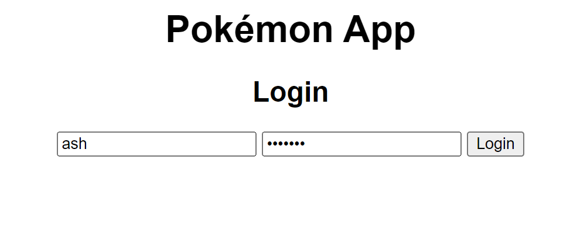
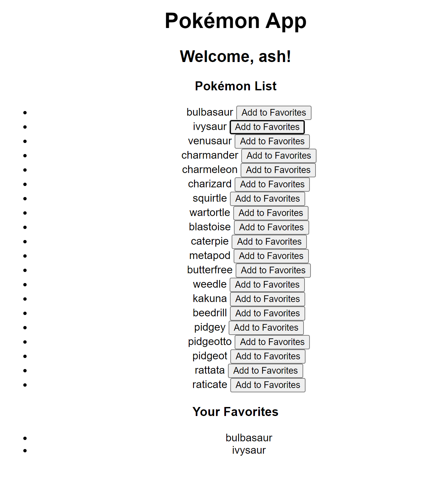

# Pokémon API Server with Express

## Demo

<!-- 
 -->

[Link to be To be added.](#)

## Setup

1. [Backend Setup](1.backend-setup.md) - Initial setup for the backend services.
2. [Frontend Setup](2.frontend-setup.md) - Initial setup for the frontend application.

## Adding Login Functionality

3. [Adding Login Component - Backend](3.adding-login-component-backend.md) - Implementing authentication in the backend.
4. [Adding Login Component - Frontend](4.adding-login-component-frontend.md) - Integrating the login component in the frontend.

## Adding Favorite Feature

5. [Adding Favorite Component - Backend](5.adding-favorite-component-backend.md) - Backend implementation for the favorite feature.
6. [Adding Favorite Component - Frontend](6.adding-favorite-component-frontend.md) - Frontend implementation for the favorite feature.

## Challenges

1. Add pagination and fetch all Pokémons from the API.
2. Add the logout functionality to clear the session.
